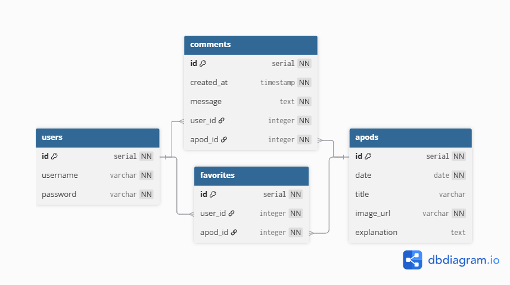

# Welcome to Stellar Archive

StellarArchive is a mobile application that fetches NASA's Astronomy Photo of the Day using [NASA's APOD API](https://api.nasa.gov/).

This application is just a side project of mine as I wanted to gain more exposure in mobile development including React Native, Expo, and REST APIs.

## Stellar Archive Demo

[](https://youtu.be/gV4Tb_dCWro)

## Database Schema



## Database Info

This is just a some quick notes I'm making. I came up with the schema first. I then made a PostgreSQL database in AWS. I wrote the SQL to create the tables and used pgAdmin to actually create the tables with the SQL. See "database" folder and "docs" folder for the SQL and schema.

## Prerequisites

- Node.js (v20.x or later, LTS recommended) This project was developed using Node.js v24.

## Setup

1. **Clone the repository**

   ```bash
   git clone https://github.com/Mac-Hawkins/StellarArchive.git
   cd StellarArchive  # Navigate into the project directory
   ```

2. **Install dependencies**
   Run the following command to install all required packages:

`npm install`

3. **Get a NASA API Key**

Sign up for a free API key from [NASA’s API portal](https://api.nasa.gov/).
Once you receive your key, create a .env file in the root directory of the project.

4. **Configure the .env file**

Add your NASA API key to the .env file using the following format:

`EXPO_PUBLIC_NASA_API_KEY=your_nasa_api_key_here`

Refer to the .env.example file for guidance.

5. **Start the app**
   Launch the app with:

`npx expo start`

This will start the Expo development server. Follow the prompts to run the app on your device or emulator. I personally used Expo Go.

# Expo Information

This is an [Expo](https://expo.dev) project created with [`create-expo-app`](https://www.npmjs.com/package/create-expo-app).

## Get started

1. Install dependencies

   ```bash
   npm install
   ```

2. Start the app

   ```bash
   npx expo start
   ```

In the output, you'll find options to open the app in a

- [development build](https://docs.expo.dev/develop/development-builds/introduction/)
- [Android emulator](https://docs.expo.dev/workflow/android-studio-emulator/)
- [iOS simulator](https://docs.expo.dev/workflow/ios-simulator/)
- [Expo Go](https://expo.dev/go), a limited sandbox for trying out app development with Expo

You can start developing by editing the files inside the **app** directory. This project uses [file-based routing](https://docs.expo.dev/router/introduction).

## Get a fresh project

When you're ready, run:

```bash
npm run reset-project
```

This command will move the starter code to the **app-example** directory and create a blank **app** directory where you can start developing.

## Learn more

To learn more about developing your project with Expo, look at the following resources:

- [Expo documentation](https://docs.expo.dev/): Learn fundamentals, or go into advanced topics with our [guides](https://docs.expo.dev/guides).
- [Learn Expo tutorial](https://docs.expo.dev/tutorial/introduction/): Follow a step-by-step tutorial where you'll create a project that runs on Android, iOS, and the web.

## Join the community

Join our community of developers creating universal apps.

- [Expo on GitHub](https://github.com/expo/expo): View our open source platform and contribute.
- [Discord community](https://chat.expo.dev): Chat with Expo users and ask questions.
