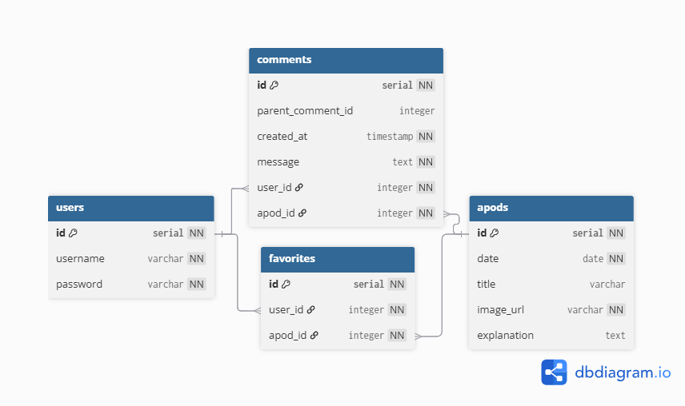

# Welcome to Stellar Archive

StellarArchive is a mobile application that allows users to fetch NASA's Astronomy Photo of the Day (APOD) using [NASA's APOD API](https://api.nasa.gov/). Users can swipe to retrieve the prior day's APOD or select a specific date to retrieve the APOD published on that day. Each APOD has an explanation associated with it, and it can be view by swiping up on the APOD. Also, each APOD can be fullscreened by tapping on it. The application also allows users to favorite an APOD to view at any time in their account page. Users can also comment on APODs as well as reply to other users underneath the explanation section.

Note: You do not have to create an account to use the app. Creating an account just enables you to favorite APODs and create comments, but you can still view APODs without an account.

The main reason I built this application was simply to gain more exposure mobile and full stack development.

## Stellar Archive Demo

[](https://youtu.be/HWR48eu5A4g)

## Architecture / Technologies Used

- Languages:
  - **TypeScript:** frontend
  - **JavaScript:** lambda functions
  - **SQL:** querying the database
- Frontend:
  - **React Native:** UI
  - **Expo:** routing between screens
- Backend:
  - **AWS**
    - **API Gateway:** used to create HTTP endpoints
    - **Lambda:** used to proccess HTTP requests (GET, POST, DELETE)
    - **Aurora and RDS:** used to create store the database
    - **CloudWatch:** used to view logs and debug issues
    - **Systems Manager:** used to store database login info
  - Database
    - **PostgreSQL:** the database itself
    - **pgAdmin4:** to connect to and create/modify the database in AWS-RDS
- Authorization
  - **JWT:** used for authenticated requests that require a user to make (favoriting, commenting, etc.)
- Development Tools
  - **VSCode:** primary IDE
  - **Git:** version control
  - **Postman:** testing API endpoints
  - **Expo Go:** mobile app testing and development
  - **AI**
    - **GitHub Copilot:** code completion and UI implementation assistance
    - **Claude / Mistral / OLMo / Microsoft Copilot:** helped with architectural decisions, debugging, and learning mobile development concepts

## Repository Layout

- app folder: contains all the screens their styles as well as the layout of the screens as requried by Expo.
- database folder: contains files relating to the database such as a diagram of the schema and code used to create it and the database.
- lambda_functions folder: contains the code I used for each lambda function in AWS. They are split up into 4 sub folders.
  - apods folder: lambda functions for the APODs
  - comments folder: lambda functions for the comments
  - favorites folder: lambda functions for the favorites
  - users folder: lambda functions for the users
- src folder: everything else such as components, constants, stores, types, etc.
  - components folder: contains UI components to not clutter screen code as much
  - constants folder: constants used throughout the code.
  - services folder: contains HTTP request code.
  - store folder: contains a zustand store for the APOD.
  - types folder: various types I created and used (enums, interfaces).
  - utils: contains various utility functions that are lengthy and used multiple times.

## Database Schema



## Database Info

After building the application logic for displaying and swiping through the APODs, I came up with the schema first using dbdiagram.io. I then createrd the PostgreSQL database in AWS-RDS based on that schema. I used pgAdmin4 to write the SQL create the tables. See "database" folder for the SQL and schema. After that, I made the API Gateways and Lambda functions in AWS to communicate with the RDS.

The database consists of 4 tables:

- users: to store the username and password of the users
- apods: to store the relevant picture information retrieved from NASA's API
- favorites: to store a favorite APOD of the user's
- comments: to store comments made by users on an APOD

## Future Improvements

I will likely not come back to the application as I would like to end my AWS trial. Having said that, I figured I should include a list of things that could improve the app if added.

- A script to run over night to query NASA (< 100 times) to collect APODs to insert into my DB.
- Move configureDbConnection to its own Lambda function. I didn't realize until the end of the project that you can call lambda functions from other lambda functions.
- Ability for user's to view their comments in their account page
  - Ability for users to click on their comments in their account page and be taken directly to the APOD and the comment
- Allow display of other media other than just images
  - Some APODs are actually videos, which the app detects and automatically skips those days when user's come across them
- General performance improvements
  - Retrieval of APODs could be smoother. Sometimes I can see the corner of the image change when it is mostly off screen before the new one comes in.

## Issues

- The biggest issue is that NASA's endpoint will sometimes take too long to respond and it will timeout. I verified this by navigating to the endpoint in a browser to ensure it wasn't just my code. I somewhat work around this by caching APODs in my database, so whenever a user swipes to a new APOD, I will first check to see if it is within my database, if it's not there, then I attempt to retrieve the APOD from NASA.

## Prerequisites

- Node.js (v20.x or later, LTS recommended) This project was developed using Node.js v24.

## Setup

1. **Clone the repository**

   ```bash
   git clone https://github.com/Mac-Hawkins/StellarArchive.git
   cd StellarArchive  # Navigate into the project directory
   ```

2. **Install dependencies**
   Run the following command to install all required packages:

   `npm install`

3. **Start the app**
   Launch the app with:

   `npx expo start`

   This will start the Expo development server. Follow the prompts to run the app on your device or emulator. I personally used Expo Go.

   Note: You may need to set your execution policy to run the above command. You can do that by running the following

   `Set-ExecutionPolicy -Scope Process -ExecutionPolicy Bypass`

# Expo Information

This is an [Expo](https://expo.dev) project created with [`create-expo-app`](https://www.npmjs.com/package/create-expo-app).

## Get started

1. Install dependencies

   ```bash
   npm install
   ```

2. Start the app

   ```bash
   npx expo start
   ```

In the output, you'll find options to open the app in a

- [development build](https://docs.expo.dev/develop/development-builds/introduction/)
- [Android emulator](https://docs.expo.dev/workflow/android-studio-emulator/)
- [iOS simulator](https://docs.expo.dev/workflow/ios-simulator/)
- [Expo Go](https://expo.dev/go), a limited sandbox for trying out app development with Expo

You can start developing by editing the files inside the **app** directory. This project uses [file-based routing](https://docs.expo.dev/router/introduction).

## Get a fresh project

When you're ready, run:

```bash
npm run reset-project
```

This command will move the starter code to the **app-example** directory and create a blank **app** directory where you can start developing.

## Learn more

To learn more about developing your project with Expo, look at the following resources:

- [Expo documentation](https://docs.expo.dev/): Learn fundamentals, or go into advanced topics with our [guides](https://docs.expo.dev/guides).
- [Learn Expo tutorial](https://docs.expo.dev/tutorial/introduction/): Follow a step-by-step tutorial where you'll create a project that runs on Android, iOS, and the web.

## Join the community

Join our community of developers creating universal apps.

- [Expo on GitHub](https://github.com/expo/expo): View our open source platform and contribute.
- [Discord community](https://chat.expo.dev): Chat with Expo users and ask questions.
